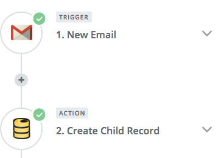
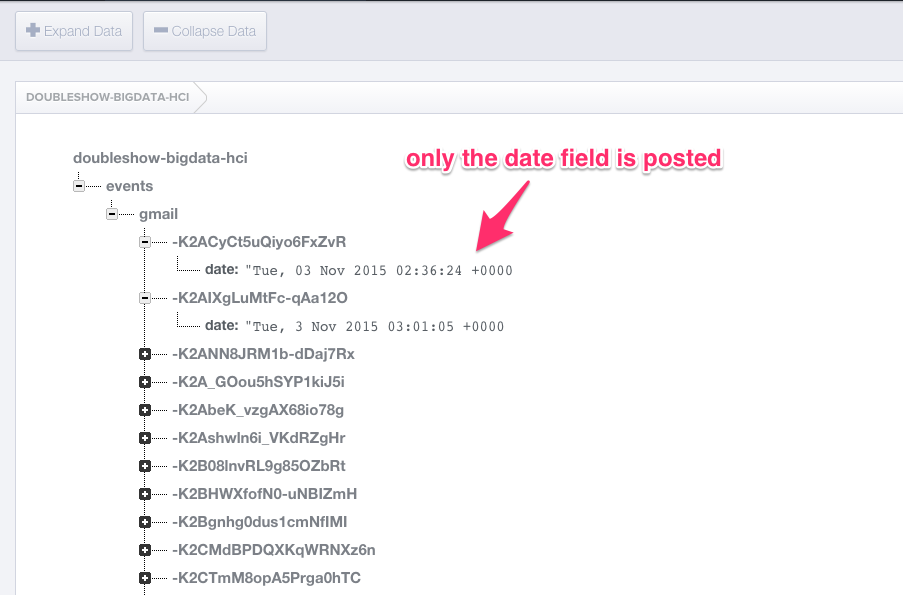

# Week 11

Analyze your online activity and share this data with the rest of the class.

## Firebase

Go to [Firebase](https://www.firebase.com/)

Set up your personal firebase using the following naming convention

    [your-github-id]-bigdata-hci.firebaseIO.com

for example

    doubleshow-bigdata-hci.firebaseIO.com

## Zapier

Use Zapier to connect _Trigger_ associated with your online accounts with
a Firebase _Action_ to create a child record under

    [your-github-id]-bigdata-hci.firebaseIO.com/events

The online accounts include gmail, facebook, and anything you use regularly.

For example, each time you receive a new email to your gmail account, you want
to write the "date" to your Firebase. On Zapier's interface, you should see
something like this:

After a few gmails events are detected, you want your Firebase control panel
to look like this

Also, the data should be accessible as `.JSON`

[http://doubleshow-bigdata-hci.firebaseIO.com/events.json](http://doubleshow-bigdata-hci.firebaseIO.com/events.json)

Note that you only want to write the timestamp (i.e., date). You don't want to share other
private information contained in your email.

## Questions about your self

__Due: Friday Nov. 6, 11:59pm__

Come up with ten interesting questions about yourself. Write code to analyze
the events stored in your own Firebase.

[me.html](me.html)

## Questions about the class

__Due: Friday Nov. 8, 11:59pm__

Come up with ten interesting questions about yourself. Write code to analyze
the events stored in everyone's Firebase.

[class.html](class.html)
